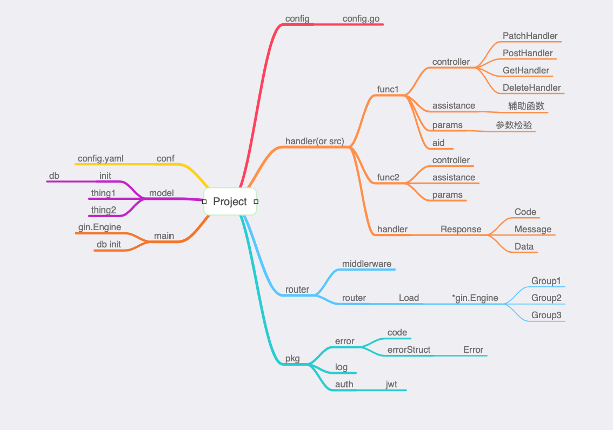

# Go Web 开发手册

> Go Web 开发手册

**本手册根据开发经验进行整理的 Go Web 开发注意事项，侧重点在编写具有 Restful 风格的 API，希望对你有所启发，同时，如果你想进行更多的补充，欢迎 Fork 项目。**

大纲:

- [需求分析](system_design.md)
- [模型设计](model_design.md)
- [技术选型](technology_design.md)
	- Go
	- ORM
		- gorm
		- xorm
	- Web 框架
		- gin
		- beego
		- go-restful
		- echo
		- iris
		- ...
	- 原生库
	    - net/http
	    - template
    - 数据库
        - mysql
        - postgres
        - es
        - redis
- [项目结构设计](project_design.md)
    - 
- [单功能开发](function_design.md)
	- 参数验证
	    - 是否必须
	    - 类型
	        - 整型
	            - 大小
	            - 区间
	            - 默认
	        - 字符串
	            - 选项
	            - 默认
	        - 数组
	            - 长度
	- 获取资源
	- 更新资源
	- 删除资源
	- 新增资源

- [认证/鉴权](jwt_design.md)
	- 权限：jwt

- API 设计
    - [Restful 风格设计](restful_design.md)
        - 路由
            - 路径参数
            - 请求参数
            - 消息体
        - 响应信息
            - 状态码
            - 资源信息
        - 错误码
            - 错误码
            - 错误信息
    - [GraphQL 风格设计](graphql_design.md)
	- Schema
		- Type
			- Scalar
				- Int
				- String
				- Boolean
				- Enum
			- Object
			- [] list
			- ! required
		- Query
		- Mutation
		- Subscription	

- [日志处理](log_design.md)
    - [代码示例](project/pkg/log/log.go)
- [错误处理](error_design.md)
    - [代码示例:错误信息定义](project/pkg/errorno/errors.go)
    - [代码示例:错误集合](project/pkg/errorno/code.go)
- [构建](makefile_design.md)
    - Makefile
    - [代码示例](project/Makefile)
- [版本管理](git_design.md)
    - git
- [文档](docs_design.md)
    - GoDoc 代码文档
        - 语法
            - package
                - 代码库的功能、特性
                - Example 主要的示例
            - function
                - 函数注释：单个函数实现什么样的功能
            - const
                - 主要的全局常量的注释
        - doc.go
            - 可以用在整个 Package 的说明
	- Swagger API 文档
	    - 路由
	    - 参数
	    - 响应
	    - Header
	- Docsify、VuePress（使用 Markdown 语法）
- [测试](test_design.md)
	- Postman 接口测试
	    - project/collections/function/post、patch、get、delete
	- 单元测试
	- 性能测试: 指标：并发数、QPS(每秒查询数 = 并发数/平均请求响应时间)、请求响应时间（TTLB: Time to last byte）
	    - 图表
	    - 单个函数
	    - pprof(import _ "net/http/pprof")
	    - 工具：Wrk, Jmeter, AB, Webbench
	- 代码覆盖率
	    - codecov
- [库管理](package_design.md)
    - 解决版本库引入管理的问题： 公开库、私有库
	- go mod
	- ~~glide~~
	- ~~vgo~~
	- ~~govendor~~
	- dep
	- ...

- [持续集成](ci_design.md)
	- travisCI
	    - 结合 codecov
	    - 结合 DockerHub

- [持续部署](cd_design.md)
	- Docker 镜像构建: DockerHub
	- DaoCloud
	    - 构建 + 部署

---

@Author: 谢伟

@WeChat: wu_xiaoshen

@ZhiHu: [谢伟](https://www.zhihu.com/people/wu-xiao-shen-16/activities)

@BiliBili:[Wuxiaoshen](https://space.bilibili.com/10056291)
